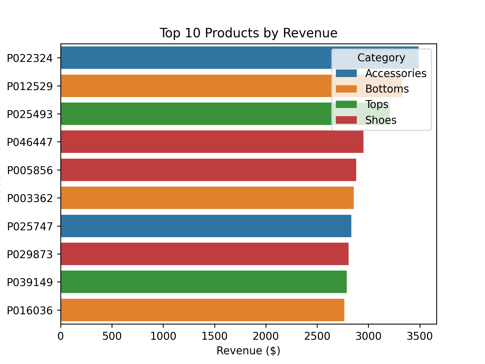
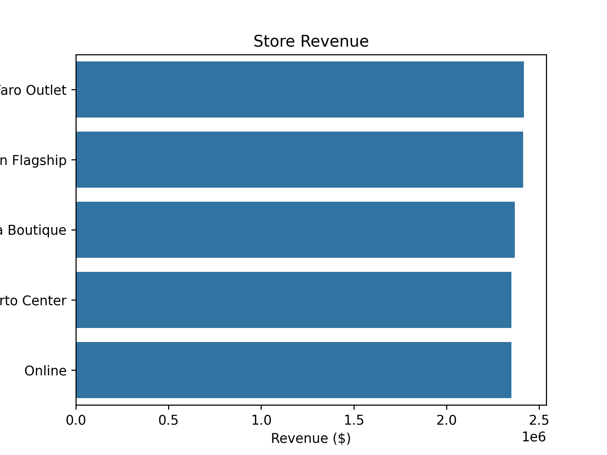

# Fashion Retail Data Analysis

### Project Overview
This project analyzes sales data from a fashion retail business to provide insights into customer purchasing behavior, product performance, and store performance. The goal is to identify top-performing customers, products, and stores, and provide actionable insights that could inform business strategy.  

### Data Documentation
The project uses four datasets (.csv files):  
- **customer_data.csv** - Customer information including ID and city.  
- **product_data.csv** - Product information including ID, category, and price.  
- **store_data.csv** - Store information including ID and store name.  
- **sales_data.csv** - Transaction data including product, customer, store, date, quantity, and discount.  

These datasets were cleaned by removing rows with missing critical identifiers (IDs) to ensure reliable analysis.  

### Tools and Packages Used
- Python (Pandas, Matplotlib, Seaborn)  
- SQLite3 for creating and querying tables  
- Jupyter Notebook for analysis  

### Analysis Sections
1. Customer Insights
   - Identified top 20 customers by total revenue (discounted).  
   - Calculated customer purchase frequency (distinct purchase dates).  
   - Observations highlight high-value and frequent buyers by city.  

2. Product Performance 
   - Top 10 products by units sold.  
   - Top 10 and bottom 10 products by revenue.  
   - Observations show which categories dominate unit sales and revenue.  

3. Store Performance
   - Total revenue per store.  
   - Number of transactions per store.  
   - Observations show differences in revenue and transaction volume across stores.  

### Key Insights
- Customers: Top spenders are concentrated in Coimbra, Braga, and Lisbon. Most customers purchase infrequently, while a small group purchase repeatedly.  
- Products: Shoes and Accessories dominate top units sold, while top revenue products include a broader mix of categories. Bottom revenue products include Dres
- Stores: Faro Outlet has the highest revenue, Lisbon Flagship has the most transactions, and Online shopping has the lowest in both categories.
