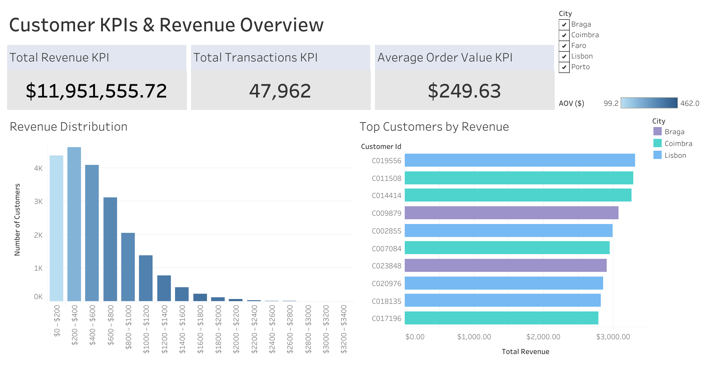
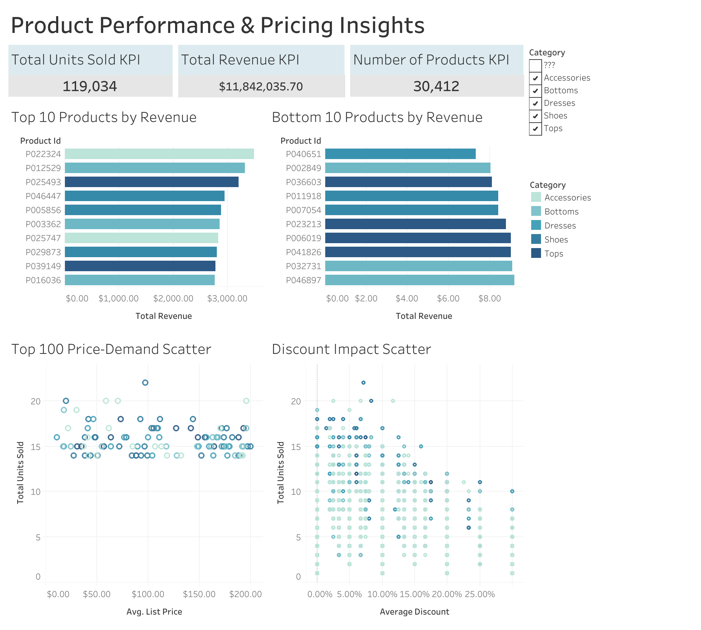
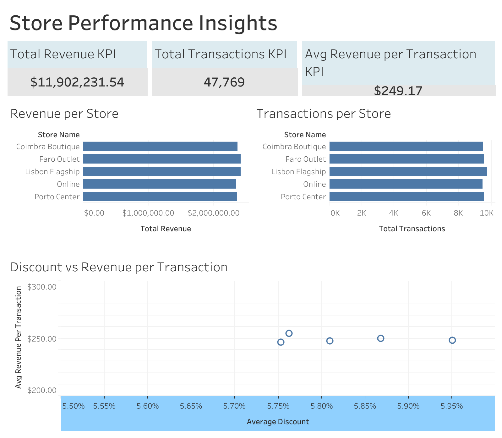

# Fashion Retail Data Analysis

## Project Overview
This project analyzes sales data from a fashion retail business to provide insights into customer purchasing behavior, product performance, and store performance. The goal is to identify top-performing customers, products, and stores, and provide actionable insights to inform business strategy.

## Datasets
The project uses six datasets (.csv files) generated from the Python notebook:

| CSV File | Description | Dashboards Used |
|----------|-------------|----------------|
| customer_kpis.csv | Customer-level KPIs including revenue, number of transactions, and average order value | Customer Dashboard |
| product_kpis.csv | Product-level KPIs including revenue, units sold, and list price | Product Dashboard |
| price_demand.csv | Product price vs units sold | Product Dashboard |
| discount_impact.csv | Discount vs units sold per product | Product Dashboard |
| store_kpis.csv | Store-level KPIs including revenue and transactions | Store Dashboard |
| store_pricing.csv | Store-level pricing information | Store Dashboard |

> Note: category_pricing.csv was created during data preparation but was not used in any dashboard

## Tools and Packages Used
- Python (Pandas, NumPy) for data cleaning and aggregation
- SQLite3 for querying and joining tables
- Jupyter Notebook for processing and initial visualization
- Tableau for visualization and dashboard creation

## Dashboards & Analysis

### 1. Customer Dashboard
**Interactive Tableau Dashboard:** https://public.tableau.com/app/profile/nick.cohn/viz/Customer_Dashboard_17693085617720/CustomerKPIs 

**Purpose:** Identify high-value customers and their purchasing behavior.  

**KPIs:**
- Total Revenue
- Total Transactions
- Average Order Value  

**Charts:**
- Revenue Distribution per Customer
- Top Customers by Revenue  

**Insights:**
- Customer revenue distribution is right-skewed with a subset of customers accounting for a disproportionately large share of the revenue.
- Top customers consistently exhibit both higher transaction counts and higher average order values, suggesting that revenue concentration is driven by a combination of purchase frequency and higher average order value rather than one factor alone.
- Top-performing customers by revenue are disproportionately represented among customers from Braga, Coimbra, and Lisbon, indicating that high-value customers are concentrated within these cities. 

---

### 2. Product Dashboard
**Interactive Tableau Dashboard:** https://public.tableau.com/app/profile/nick.cohn/viz/product_dashboard_17709299125630/ProductPerformancePricingInsights 

**Purpose:** Analyze product performance and pricing/discount impact.  

**KPIs:**
- Total Revenue
- Total Units Sold
- Number of Products  

**Charts:**
- Top 10 Products by Revenue
- Bottom 10 Products by Revenue
- Price vs Demand Scatter (top 100 products by units sold)
- Discount Impact Scatter  

**Insights:**
- Revenue disparities between top- and bottom-performing products are driven by demand rather than pricing, with top products having 10-20 unit sales and bottom products having single-unit sales. This results in marginal revenue for the lowest performing products. 
- No strong linear relationship is observed between product price and units sold across all categories, indicating that price differences alone do not explain the variation in product demand.
- Discounting does not consistently increase unit sales, with many high-volume products clustered primarily at low discount levels (at the 0-10\% discount range), indicating diminishing returns to aggressive discounting. 
- Category-level demand patterns differ significantly, with accessories concentrated around lower unit sales while categories such as tops, shoes, and dresses dominate higher unit sales.

---

### 3. Store Dashboard
**Interactive Tableau Dashboard:** https://public.tableau.com/app/profile/nick.cohn/viz/Store_dashboard_17717089088640/StorePerformanceInsights 

**Purpose:** Evaluate store-level performance and transactional efficiency.  

**KPIs:**
- Total Revenue
- Total Transactions
- Average Revenue per Transaction  

**Charts:**
- Revenue per Store
- Transactions per Store
- Discount vs Revenue per Transaction Scatter  

**Insights:**
- Lisbon Flagship and Faro Outlet generate high revenue and transaction volumes, while Online stores performed the worst in terms of both metrics; however performance differences across stores remain marginal.
- Average revenue per transaction is relatively consistent across stores, suggesting that there is similar purchasing behavior and pricing effectiveness for the locations.
- Higher store-level discounting does not significantly correspond to higher revenue per transaction, indicating that discount strategies may not meaningfully improve the average revenue generated per sale.

---

## Key Takeaways
- Customer revenue is highly concentrated, with a small subset of high-frequency, high-spending customers driving a disproportionate share of total revenue; these top customers were disproportionately concentrated in Braga, Coimbra, and Lisbon.
- Product performance is primarily demand-driven rather than price-driven, with limited evidence that higher prices or aggressive discounting consistently improve unit sales.
- Discounting shows diminishing returns at both the product and store levels, suggesting that volume gains from discounts may not translate into higher per-transaction value.
- Store-level performance differences are driven more by transaction volume than by pricing or discount intensity, indicating similar purchasing behavior across store locations.

## Scope & Assumptions
- This Kaggle dataset is a mock representation of retail sales and is intended for analytical and visualization practice rather than real-world forecasting or causal inferences.
- Insights were derived from cross-sectional aggregates and should be interpreted as descriptive patterns rather than causal relationships.
- Analysis focuses on customer, product, and store performances using available attributes without access to temporal or demographic dimensionality (except for customer data having city-level information).
